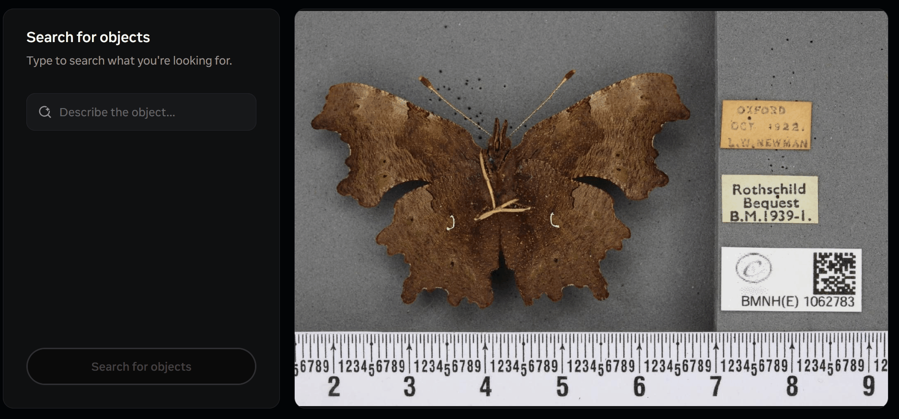

# Image Segmentation with Grounded SAM

This is a minimal starter repo to use the GroundedSAM model for image segmentation via text-based input.

- [GroundedSAM repo](https://github.com/IDEA-Research/Grounded-Segment-Anything)
- [Autodistill repo](https://github.com/autodistill/autodistill-grounded-sam)


(Note: this animation shows SAM3, but the principle is the same)

## Quickstart

1\. Install *mamba* via [miniforge](https://github.com/conda-forge/miniforge), or use *conda* (Miniconda/Anaconda)

2\. Create the environment from `environment.yml`:

```powershell
mamba env create -f environment.yml -n grounded-sam1
mamba activate grounded-sam1
```

3\. Optional: install PyTorch with GPU (NVIDIA) support. If you have a compatible CUDA GPU and drivers, install the CUDA build from the official channels:

```powershell
mamba install nvidia::cuda-toolkit==12.6
pip install torch torchvision --index-url https://download.pytorch.org/whl/cu126 --force-reinstall
```

If you do not have a GPU, you can skip this step. Autodistill and Grounded SAM will run on CPU but will be MUCH slower.

4\. Run the notebook 

## Notes

- The provided `environment.yml` keeps PyTorch out by default so you can choose CPU or GPU builds explicitly.
- If you run into build issues on Windows, ensure you created the env from `conda-forge` and installed PyTorch from the `pytorch`/`nvidia` channels when using CUDA.
- Data directories like `data/`, `datasets/`, `outputs/` are git-ignored by default; customize `.gitignore` as needed.
